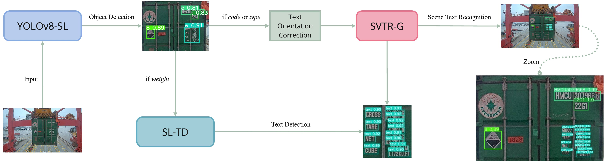

# Fast and Lightweight Automatic Shipping Container Attribute System (FLASS)

The official code of [FLASS]

The pipeline is shown in the following figure.



Detailed figures for each model [src](src/)

## Install requirements

- This work was tested with PyTorch 2.1.0, paddlepaddle 2.6.1, CUDA 12.4, python 3.10 and Ubuntu 22.04. 

- To install other dependencies:

```bash
   pip install -r requirements.txt
```
  
## Pretrained Models

Available model weights:

| [YOLOv8-SL](weights/YOLOv8-SL.pt) |   [SL-TD](weights/SL-TD.pt)   | [SVTR-G](weights/SVTR-G.pdparams) |

## Dataset

Unfortunately, due to dataset privacy, we cannot share training and testing images.

#### Notice:

- You can run inference directly on images with a size of 1920x1080 without resizing.

## Inference

1. Modify `img_path` in `predict.py` accordingly.

```bash
   python predict.py
```


## Acknowledgements

This implementation has been based on these repository [YOLOv8](https://github.com/ultralytics/ultralytics.git), [PaddleOCR](https://github.com/PaddlePaddle/PaddleOCR.git)

### Feedback

Suggestions and discussions are greatly welcome. Please contact the authors by sending email to `cheasovorn4@gmail.com`